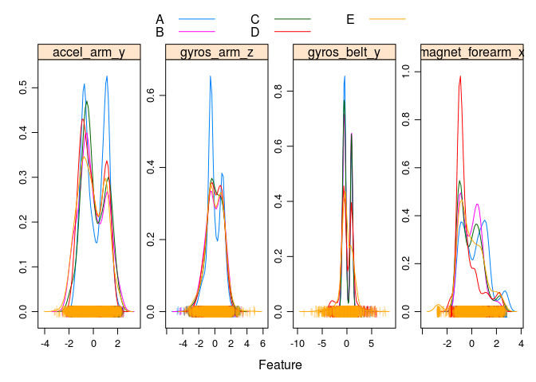

# Course project - Practical machine learning
Aurimas R.  
02/17/2015  


This reports presents the process of building a machine learning algorithm for differentiating between correct and incorrect usage of dumbbell based on data collected from wearable sensors attached to dumbbell users. First, the data collected is considered; then, its preprocessing and feature selection is discussed. Three different ML models are built and using cross-validation techniques the best model is selected. The best model uses random forests technique and achieved near 100% accuracy in out-of-sample testing.

#Data overview


The data used to build the ML algorithms is from a study by Velloso, E.; Bulling, A.; Gellersen, H.; Ugulino, W.; Fuks, [(H. Qualitative Activity Recognition of Weight Lifting Exercises)](http://groupware.les.inf.puc-rio.br/har). Note that the original study does not include a codebook, so this report infers them from their names. The training dataset includes 19622 observations and 160 variables. The variables can be grouped into the following categories:

* Metadata: observation id ("X"), name of participant ("user_name")
* Time-related metadata: timestamps of observations and variables indicating the sliding window of observations (' raw_timestamp_part_1 ', ' raw_timestamp_part_2 ', ' cvtd_timestamp ', ' new_window ', ' num_window ')
* Sensor data from four sensors attached to belt, arm, forearm and dumbbell:
    * Six types of data are included: yaw, roll and pitch (3-dimensional axes), acceleration (x/y/z dimensions), magnetical data (x/y/z dimensions), and gyroscope (x/y/z dimensions) data.
    * For each sensor-data combination the following statistics are included: raw data, kurtosis, skenewess, maximum, minimum, amplitude, average, standard deviation and variance.
* Class, indicating whether the dumbbell was used correctly (A class indicates correct lifting; classes B-E indicate different wrong lifting types; see original paper for details)

The data is quite balanced, with all classes represented relatively equally (slightly more of class A):

```
## 
##    A    B    C    D    E 
## 5580 3797 3422 3216 3607
```

#Preprocessing

Several pre-processing steps were performed:

1) All variables were converted to appropriate forms (e.g. numeric / time or date / factors)
2) Variables with over 50% of missing entries were deleted (this removed 67 variables)
3) metadata (see data description above, #1 and #2) was excluded and a ML prediction algorithm should be generic and not depend on this data.
4) Zero-variance variables were deleted (defined as variables where less than 5% of values are unique). This resulted in additional 33 variables removed.
5) A check for linearly related features was performed (none found).
6) All numeric features were scaled to 1 standard deviation and centered around 0.

This resulted in a training dataset with 19622 observations and 53 remaining features. For implementation details, we refer to the [preprocessing R script](preprocessing.R).

#Analysis performed

Before a model is built, it is important to consider if all variables should be included as features. However, due to lack of domain knowledge and detailed codebook, the author of this paper had to rule out any knowledge-based selection. Instead, an ad-hoc graphical inspection was performed. As the density plots indicate, randomly selected 4 variables all show limited variations between classes. A more detailed review of correlation matrices also did not reveal clear indications for model selection. Instead, all variables will be included as features into the models.
 
 


#Model selection


Model selection was performed as follows:

1) Three different algorithms were considered: classification trees, stochastic gradient boosting and random forests;
2) Training dataset was divided into three parts: training set, cross-validation set and testing set.
    * Training set will be used to train the three different models
    * Cross-validation set will be used to determine the best performing algorithm (based on accuracy)
    * Testing set will be used to approximate an out-of-sample accuracy
3) All algorithms were tuned by using simple bootstrapping (25 resampling iterations, caret default). In particular, this means that the classification trees were tuned to 1 parameter, stochastic gradient boosting to 3 parameters and random forests to 1 parameter.

The implementation details of the model selection are presented in [a prediction R script](prediction.R). Note that model training is resource-heavy, and while the underlying code relies on `data.table` and `parallel` packages to speed up the process, the whole procedure takes ~1 hour on a modern, 8 GB RAM, 8-core processor laptop.
    
##Performance of three models

The three models achieved the following accuracy on the training set:

```
## [1] "Accuracy on training data - CART:  56%"
```

```
## [1] "Accuracy on training data - random forests:  100%"
```

```
## [1] "Accuracy on training data - Gradient Boosting:  97.7%"
```

The performance on the cross-validation set was as follows:

```
## [1] "Accuracy on CV data - CART:  57%"
```

```
## [1] "Accuracy on CV data - random forests:  99%"
```

```
## [1] "Accuracy on CV data - Gradient Boosting:  96.6%"
```

Based on the above, we selected random forests as the top performing algorithm. To estimate the out-of-sample accuracy (1 - error rate), we tested its accuracy over the testing set:


```
## Confusion Matrix and Statistics
## 
##           Reference
## Prediction    A    B    C    D    E
##          A 1666   13    0    0    0
##          B    8 1117    8    1    0
##          C    0    9 1017   20    2
##          D    0    0    1  943    6
##          E    0    0    0    0 1074
## 
## Overall Statistics
##                                          
##                Accuracy : 0.9884         
##                  95% CI : (0.9854, 0.991)
##     No Information Rate : 0.2845         
##     P-Value [Acc > NIR] : < 2.2e-16      
##                                          
##                   Kappa : 0.9854         
##  Mcnemar's Test P-Value : NA             
## 
## Statistics by Class:
## 
##                      Class: A Class: B Class: C Class: D Class: E
## Sensitivity            0.9952   0.9807   0.9912   0.9782   0.9926
## Specificity            0.9969   0.9964   0.9936   0.9986   1.0000
## Pos Pred Value         0.9923   0.9850   0.9704   0.9926   1.0000
## Neg Pred Value         0.9981   0.9954   0.9981   0.9957   0.9983
## Prevalence             0.2845   0.1935   0.1743   0.1638   0.1839
## Detection Rate         0.2831   0.1898   0.1728   0.1602   0.1825
## Detection Prevalence   0.2853   0.1927   0.1781   0.1614   0.1825
## Balanced Accuracy      0.9961   0.9886   0.9924   0.9884   0.9963
```

It appears that overfitting should not be a significant issue, as the model performed nearly perfectly - just as it did in the previous datasets. Note that all three models are provided as RData files in folder [`data`](data) in case the reader would like to try them out independently.
 
#Potential improvements

While the above model performed perfectly, there are potential improvements to be made. In particular, the training time is very high (~30 minutes for the selected model). We investigate possibilities to reduce the number of features in the model to cut down training time. 

This was done by selecting only top 5 features identified as most important by `varImp()` function.


```
## [1] "roll_belt"         "pitch_forearm"     "yaw_belt"         
## [4] "magnet_dumbbell_z" "pitch_belt"
```

We then retrained random forest model using only the top 5 features. The results were as follows:

```
## [1] "Accuracy on training data - random forests (5-features):  99.9%"
```

```
## [1] "Accuracy on CV data - random forests (5-features):  96.3%"
```

In conclusion, if the small precision loss is acceptable, significant efficiency gains can be gained by limiting features to top 5. This already indicates that not all sensors are needed and further analysis could reveal that high accuracy may be achievable with 2 or even 1 sensor at all. This would have significant implications to actual implementation of such monitoring in real world.
